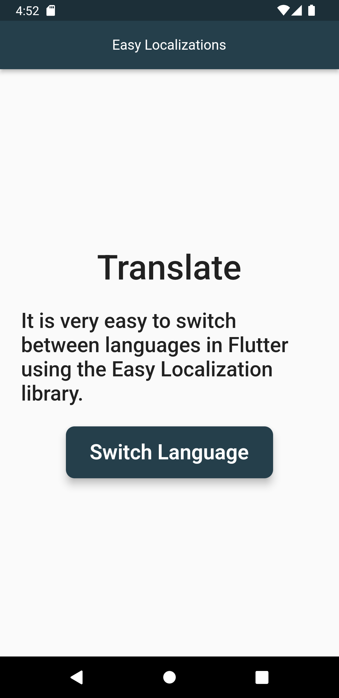
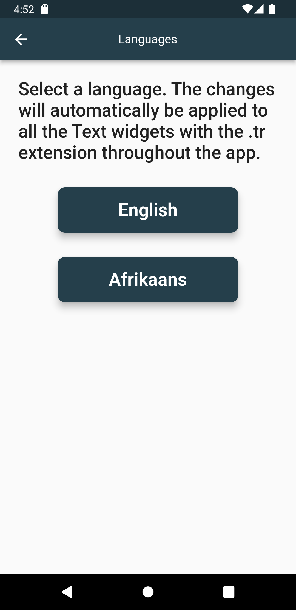
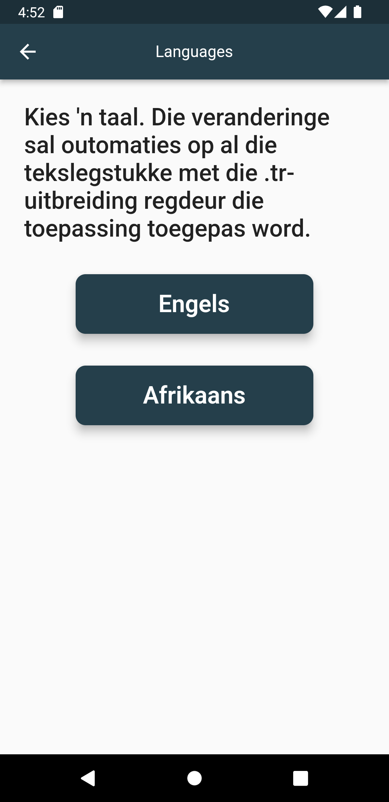
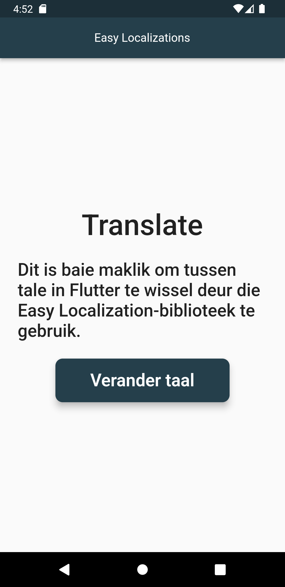

# Flutter Localization Sample App

## Description
This is a Flutter app that is localized to use English and Afrikaans using Easy Localizations & Provider packages. The app basically allows you to switch Languages inside the app without changing the device locale.

## 3rd Party Services & Packages
We used the following services and packages for this project:
1. [Google Translate](https://translate.google.com/) - Used to translate English to Afrikaans
2. [Locale Code](https://saimana.com/list-of-country-locale-code/) - Used to find locale code, however you can basically google locale codes
3. [Locale Codes Alternative](http://www.lingoes.net/en/translator/langcode.htm) - Alternative locale codes that you can use
4. [easy_localization](https://pub.dev/packages/easy_localization) - this package is used to translate languages easily
5. [provider](https://pub.dev/packages/provider) - this package is used for easy state management 

## How to update and add more content 
Inorder to update content you have to update files inside assets/translations/
1. Create a key and provide its value e.g "title": "Localized App" in en-US.json
2. Use same key and provide a translated value e.g "title": "Gelokaliseerde App" in af-ZA.json

## App Screenshots

## App Screenshots from Folder

Happy Coding!
 
